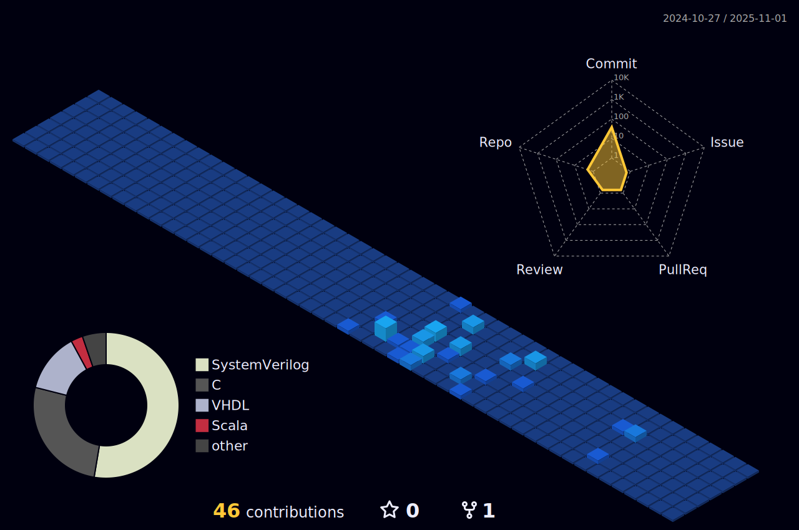

<h1 align="center">Hi 👋, I'm Chamath</h1>
<h3 align="center">A passionate Computer Engineering Student from University of Peradeniya, Sri Lanka.</h3>

I am a dedicated Computer Engineering student with a profound interest in Programming, Hardware Design, AI, and Machine Learning. Driven by my insatiable curiosity, I am enthusiastic about staying updated on the latest developments in the tech industry. My goal is to contribute meaningfully to the world and make a positive impact.

<h3 align="left">Languages and tools I'm familiar with:</h3>

 
     
     
     
     
     
     
     
     
     
     
     
     
   
</a> 

 

<h3 align="center">Connect with me on,</h3>

